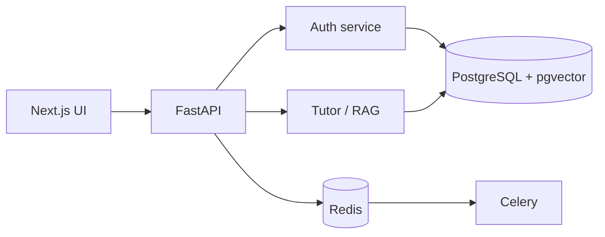

# GATE AI Tutor

[](https://github.com/YOUR_ORG/AI-tutoring-Platform-for-gate-cs-student/actions/workflows/ci.yml)

> An adaptive AI learning platform for GATE Computer Science preparation.

An interview-ready monorepo with FastAPI authentication, Next.js learner pages, async PostgreSQL, Redis, and modular AI/RAG extension points.

## Architecture


## Stack
| Layer | Technology |
|---|---|
| Backend | Python 3.11, FastAPI, Pydantic, SQLAlchemy async |
| Data | PostgreSQL 15, pgvector, Alembic |
| Jobs | Redis, Celery |
| Frontend | Next.js, React, TypeScript |
| Delivery | Docker Compose, GitHub Actions |

## Getting started
Copy `.env.example` to `.env`, then run `docker compose up --build`. Frontend http://localhost:3000, API docs http://localhost:8000/docs, health `curl http://localhost:8000/health`. Use a unique JWT secret outside local development.

## Why this project is interview-ready?
It demonstrates a vertical slice across auth, data models, API, UI, migrations, containers, CI, and test strategy. Quality/performance values are kept unmeasured until an actual run.

## Engineering Highlights
- Modular core, API, schema, model, and service boundaries.
- Abstract LLM/embedding provider and vector-store seams.
- pgvector foundation, hybrid retrieval design, citations and reranker plan.
- Scale from 100 to 100,000 users with stateless replicas, load balancing, DB pooling/read replicas, managed Redis, autoscaled workers, embedding caching and LLM quotas.
- Request IDs, JSON logs, Prometheus and OpenTelemetry instrumentation plan.
- bcrypt, typed JWT, RBAC model, validation, rate limiting and prompt injection guardrails.
- Unit/integration/e2e coverage plan and RAG regression harness.
- CI lint/type/format/test and Docker image builds.

## Resume Highlights
`metrics.json` lists requested fields; unavailable measurements are null and should be replaced with evidence from CI/load/evaluation runs.

## Documentation
[Architecture](docs/architecture.md) · [RAG](docs/rag.md) · [API](docs/api.md) · [Deployment](docs/deployment.md) · [Security](docs/security.md) · [Evaluation](docs/evaluation.md)

## Start commands
```sh
cp .env.example .env
docker compose up --build
docker compose exec api poetry run pytest -q
```

## Deliverables checklist
- [x] Local Compose web/API/database/cache scaffold
- [x] Authentication API and docs
- [ ] Live demo (deployment credentials/domain needed)
- [ ] Public repository (GitHub CLI/credentials unavailable here)


