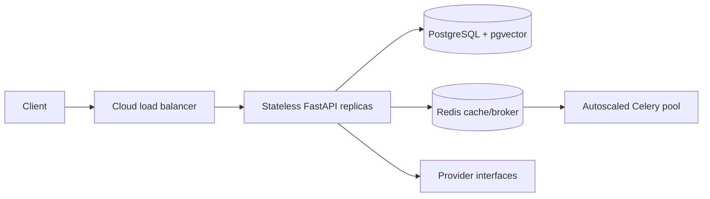

# Architecture and scalability

Scale from 100 to 100,000 users with horizontal stateless API replicas, pooled DB connections/read replicas, managed or sharded Redis, and queue-depth worker autoscaling. Batch model calls, cache embeddings, and enforce model quotas. pgvector works for early millions; benchmark and consider Milvus above roughly 10M vectors behind the VectorStore interface.
