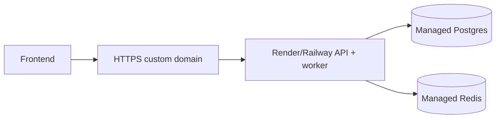

# Deployment

Set DATABASE_URL, REDIS_URL, JWT_SECRET_KEY, JWT_ALGORITHM, token lifetimes and WEB_ORIGIN in platform secrets. Deploy web to Vercel with NEXT_PUBLIC_API_URL, API and worker as distinct services. Run Alembic during release; use provider TLS and restrict CORS to the frontend origin.
