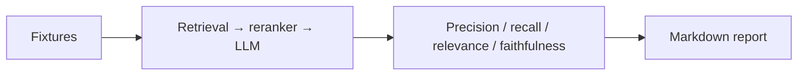

# Evaluation

Run `python scripts/evaluate_rag.py`. With provider adapters, measure source-match precision/recall, ROUGE/BLEU, separate-model faithfulness, citation accuracy, latency and token-based cost. Current metrics remain unmeasured until a real corpus/model is configured.
