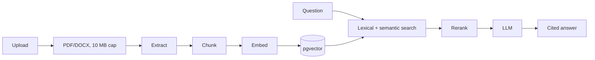

# Retrieval augmented generation

Metadata includes document_id, source_uri, page, subject, chunk_index, content_hash, embedding_model and created_at. Ingest extracts, chunks with overlap, embeds and persists. Retrieval fuses vector and keyword matches, reranks, then cites source links. Provider-backed indexing is an extension point.
