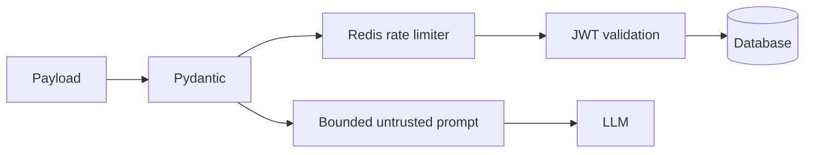

# Security

Passwords use bcrypt; tokens check expiry and access/refresh type. Keep secrets in environment, rotate them, and use HTTPS. Restrict CORS. Add SlowAPI endpoint limits backed by shared Redis. Future upload routes must accept PDF/DOCX only, inspect MIME and enforce 10 MB. Prompt delimiting is defense in depth, not a guarantee. Avoid logging secrets or full prompts.
